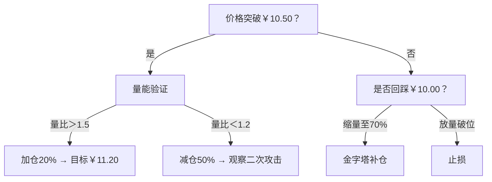

# Mermaid决策树图表功能说明

## 功能概述

本功能允许AI在盘面分析中生成可视化的决策树图表，帮助用户更好地理解交易策略和操作流程。

## 技术实现

### 1. 后端AI提示词
在`StockAnalysisAI.java`中，我们更新了盘面分析部分的提示词，要求AI生成标准的Mermaid语法代码：

```java
🔀 多路径决策树（实时更新）

```

### 2. 前端渲染组件

#### MermaidChart组件 (`MermaidChart.js`)
- 自动检测运行环境（Web vs 移动端）
- Web版本：使用Mermaid.js渲染图表
- 移动端：显示代码和提示信息

#### 集成到AnalysisResultView
- 自动检测Mermaid代码块（```mermaid...```）
- 提取代码内容并传递给MermaidChart组件
- 支持多种图表类型

### 3. Web版本支持
- 创建了`web/index.html`演示页面
- 使用CDN加载Mermaid.js库
- 支持响应式图表渲染

## 使用方法

### 1. AI生成图表
当用户请求股票分析时，AI会自动在盘面分析部分生成包含Mermaid语法的决策树代码。

### 2. 前端显示
- **移动端**：显示代码和提示信息
- **Web版本**：自动渲染为可视化图表

### 3. 图表类型支持
- 流程图 (graph TB/LR)
- 时序图 (sequenceDiagram)
- 甘特图 (gantt)
- 类图 (classDiagram)
- 状态图 (stateDiagram)

## 示例图表

### 交易决策树
```
graph TB
    A[开盘价格] -->|高开>2%| B[追涨策略]
    A -->|低开<-1%| C[防守策略]
    A -->|平开±0.5%| D[网格交易]
    
    B -->|量比>1.5| E[加仓20%]
    B -->|量比<1.2| F[减仓50%]
    
    C -->|支撑位| G[金字塔补仓]
    C -->|破位| H[止损]
```

### 风险控制流程图
```
graph LR
    A[市场信号] -->|利好| B[加仓]
    A -->|利空| C[减仓]
    A -->|中性| D[观望]
    
    B -->|风险>阈值| E[止盈]
    C -->|风险>阈值| F[止损]
```

## 配置选项

### Mermaid主题
```javascript
mermaid.initialize({
    theme: 'default',        // 可选: default, forest, dark, neutral
    flowchart: {
        useMaxWidth: true,   // 自适应宽度
        htmlLabels: true,    // HTML标签支持
        curve: 'basis'       // 曲线样式
    }
});
```

### 图表样式
- 节点颜色：自动根据内容类型分配
- 连线样式：支持箭头、标签、虚线等
- 布局方向：TB(上到下)、LR(左到右)、BT(下到上)、RL(右到左)

## 注意事项

1. **移动端限制**：React Native环境无法直接渲染Mermaid图表，显示代码和提示
2. **Web版本**：需要网络连接加载Mermaid.js库
3. **性能考虑**：复杂图表可能影响渲染性能，建议限制节点数量
4. **兼容性**：确保浏览器支持SVG和现代JavaScript特性

## 扩展功能

### 1. 交互式图表
- 点击节点显示详细信息
- 悬停显示操作提示
- 动态更新图表内容

### 2. 自定义样式
- 支持用户自定义颜色主题
- 可配置节点和连线样式
- 支持暗色/亮色模式切换

### 3. 导出功能
- 图表导出为PNG/SVG格式
- 支持打印优化
- 分享到社交媒体

## 故障排除

### 常见问题
1. **图表不显示**：检查Mermaid.js是否正确加载
2. **语法错误**：验证Mermaid代码语法
3. **样式异常**：检查CSS样式冲突
4. **性能问题**：简化复杂图表结构

### 调试技巧
- 使用浏览器开发者工具查看控制台错误
- 检查网络请求是否成功加载Mermaid.js
- 验证HTML结构是否正确
- 测试简单的Mermaid代码片段

## 总结

Mermaid决策树图表功能为股票分析提供了直观的可视化支持，通过AI生成的策略流程图，用户可以更好地理解复杂的交易逻辑和风险控制机制。该功能在Web版本中提供完整的图表渲染，在移动端提供代码预览和功能说明，确保跨平台的一致体验。
